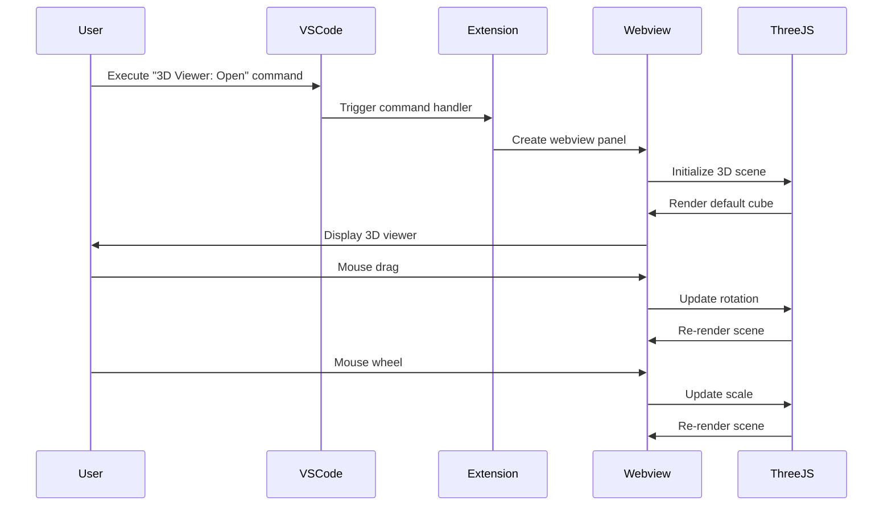

# Design Document

## Overview

VS Code拡張機能として3Dビューアーを実装します。この拡張機能は、VS CodeのWebview APIを使用してThree.jsベースの3Dレンダリング環境を提供し、ユーザーがインタラクティブに3Dオブジェクト（初期は立方体）を操作できるようにします。

## Architecture

### High-Level Architecture

```
┌─────────────────────────────────────────────────────────────┐
│                    VS Code Extension Host                   │
├─────────────────────────────────────────────────────────────┤
│  Extension Main Process (extension.ts)                     │
│  ├─ Command Registration                                    │
│  ├─ Webview Panel Management                               │
│  └─ Resource Management                                     │
├─────────────────────────────────────────────────────────────┤
│                    Webview Panel                           │
│  ├─ HTML Container                                         │
│  ├─ Three.js 3D Engine                                     │
│  ├─ Event Handlers (Mouse/Wheel)                          │
│  └─ 3D Scene Management                                    │
└─────────────────────────────────────────────────────────────┘
```

### Component Interaction Flow



## Components and Interfaces

### 1. Extension Main Module (`extension.ts`)

**責任:**
- コマンドの登録と処理
- Webviewパネルの作成と管理
- リソースのクリーンアップ

**主要インターフェース:**
```typescript
interface ExtensionAPI {
  activate(context: vscode.ExtensionContext): void;
  deactivate(): void;
  openViewer(): void;
}

interface ViewerPanelManager {
  createPanel(): vscode.WebviewPanel;
  getWebviewContent(): string;
  dispose(): void;
}
```

### 2. Webview Content Module

**責任:**
- HTMLコンテンツの生成
- Three.jsライブラリの統合
- CSP（Content Security Policy）の設定

**主要インターフェース:**
```typescript
interface WebviewContentProvider {
  getHtmlContent(webview: vscode.Webview): string;
  getThreeJsScript(): string;
  getViewerScript(): string;
}
```

### 3. 3D Viewer Module (Webview内で実行)

**責任:**
- Three.jsシーンの初期化
- 3Dオブジェクトの作成と管理
- ユーザーインタラクションの処理

**主要インターフェース:**
```typescript
interface ThreeDViewer {
  init(): void;
  createScene(): THREE.Scene;
  createCube(): THREE.Mesh;
  setupCamera(): THREE.PerspectiveCamera;
  setupRenderer(): THREE.WebGLRenderer;
  setupControls(): void;
  animate(): void;
}

interface InteractionHandler {
  onMouseDown(event: MouseEvent): void;
  onMouseMove(event: MouseEvent): void;
  onMouseUp(event: MouseEvent): void;
  onWheel(event: WheelEvent): void;
}
```

## Data Models

### 3D Scene State
```typescript
interface SceneState {
  rotation: {
    x: number;
    y: number;
    z: number;
  };
  scale: {
    x: number;
    y: number;
    z: number;
  };
  camera: {
    position: THREE.Vector3;
    target: THREE.Vector3;
  };
}
```

### Interaction State
```typescript
interface InteractionState {
  isDragging: boolean;
  lastMousePosition: {
    x: number;
    y: number;
  };
  rotationSpeed: number;
  scaleSpeed: number;
  minScale: number;
  maxScale: number;
}
```

### Viewer Configuration
```typescript
interface ViewerConfig {
  backgroundColor: number;
  cubeColor: number;
  lightIntensity: number;
  cameraFov: number;
  cameraPosition: THREE.Vector3;
}
```

## Error Handling

### WebGL Support Detection
```typescript
interface WebGLChecker {
  isWebGLSupported(): boolean;
  showWebGLError(): void;
}
```

### Error Types
1. **WebGL Not Supported**: ブラウザまたはシステムがWebGLをサポートしていない
2. **Resource Loading Error**: Three.jsライブラリの読み込み失敗
3. **Rendering Error**: 3Dシーンのレンダリング中のエラー
4. **Memory Error**: 大量の3Dデータによるメモリ不足

### Error Handling Strategy
- WebGL未サポート時は適切なエラーメッセージを表示
- Three.jsの読み込み失敗時はフォールバック表示
- レンダリングエラー時は自動復旧を試行
- メモリエラー時はリソースの解放を実行

## Testing Strategy

### Unit Tests
1. **Extension Commands**: コマンド登録と実行のテスト
2. **Webview Creation**: Webviewパネルの作成と設定のテスト
3. **HTML Content Generation**: HTMLコンテンツの正確性テスト
4. **Resource Management**: リソースの適切なクリーンアップテスト

### Integration Tests
1. **End-to-End Workflow**: コマンド実行から3D表示までの完全なフロー
2. **Multiple Panel Management**: 複数のビューアーパネルの独立動作
3. **Error Scenarios**: WebGL未サポート環境でのエラーハンドリング

### Manual Testing
1. **User Interaction**: マウス操作による回転・拡大縮小の動作確認
2. **Performance**: 長時間使用時のメモリリークやパフォーマンス劣化の確認
3. **Cross-Platform**: 異なるOS環境での動作確認

### Test Environment Setup
- VS Code Extension Test Runner を使用
- Three.jsのモックオブジェクトを作成してWebview外でのテストを可能にする
- WebGLコンテキストのモックを使用してヘッドレス環境でのテストを実現

## Performance Considerations

### Rendering Optimization
- アニメーションループの最適化（requestAnimationFrame使用）
- 不要な再描画の回避
- オブジェクトの適切なジオメトリとマテリアル設定

### Memory Management
- Webviewパネル閉じ時のThree.jsリソースの適切な解放
- テクスチャとジオメトリの効率的な管理
- イベントリスナーの適切な削除

### Scalability
- 将来的な複数オブジェクト対応への拡張性を考慮
- モジュラー設計による機能追加の容易性